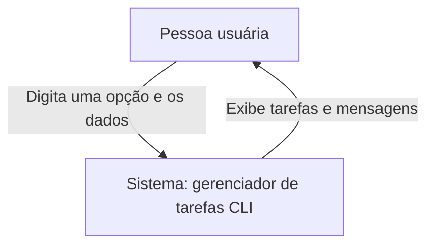
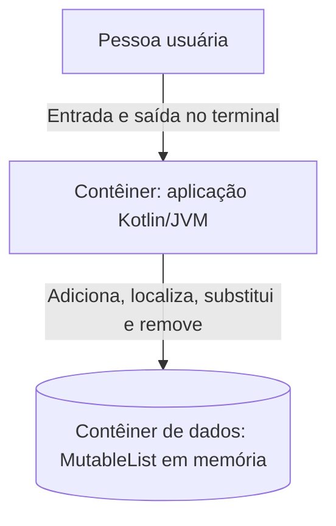
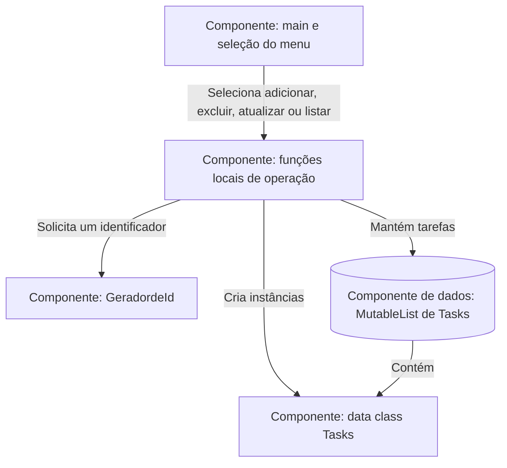
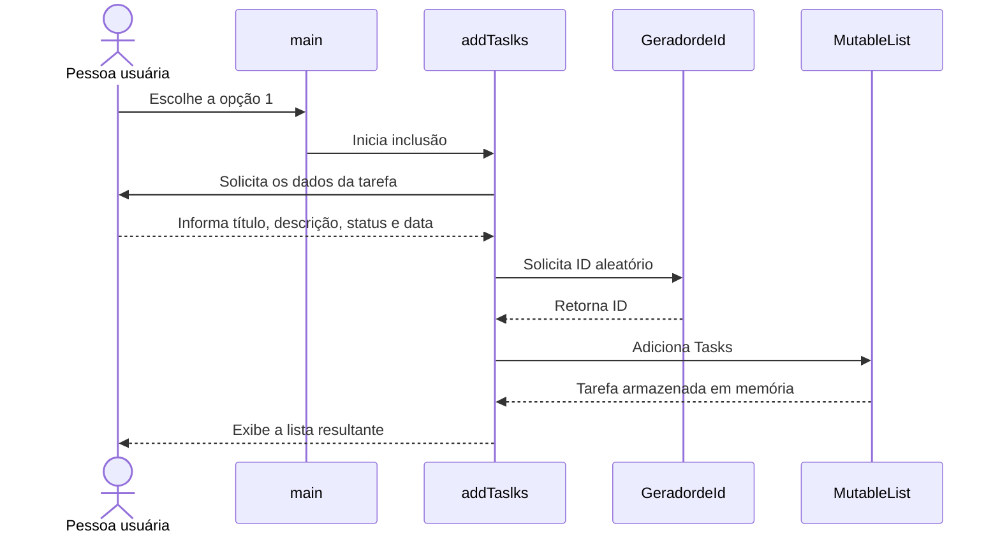

# Task List Challenge in Kotlin — C4 Model

[README](../../README.md) · [Português](#português) · [English](#english)

Documentação baseada no código do repositório em 20 de setembro de 2026.  
Architecture documentation based on the repository code as of September 20, 2026.

## Português

### Nível 1 — Contexto do sistema

### Nível 2 — Contêineres

### Nível 3 — Componentes da aplicação

> Os componentes abaixo são responsabilidades lógicas dentro do único arquivo `Desafio.kt`, e não módulos físicos separados.

### Fluxo principal — adicionar tarefa

## English

### System context

The user operates a local command-line task manager. All input and output passes through the terminal, and no external service is involved.

### Containers and components

The Kotlin/JVM process contains the menu, local operation functions, the `Tasks` data class, and the random ID generator. A `MutableList<Tasks>` provides temporary storage for the current process.

### Key decisions and boundaries

- The whole application currently lives in one Kotlin source file.
- In-memory storage keeps the example simple but loses all data when the process ends.
- Menu branches demonstrate individual collection operations, but the application does not run a continuous interaction loop.
- Input validation, persistence, automated tests, and explicit separation of concerns are natural next steps.

## Evolution notes

Extract task operations into a service, introduce a repository abstraction, add a menu loop and validation, persist data locally, and cover the behavior with unit tests before evolving the project into a larger application.
